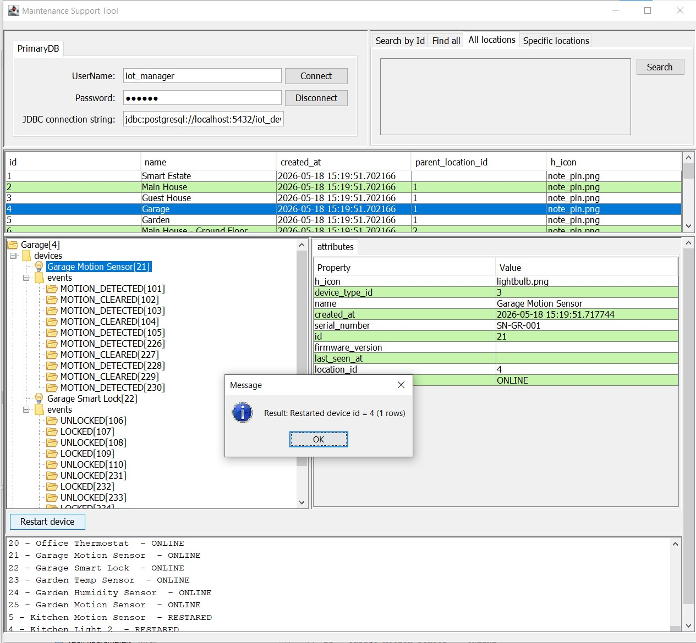

# maintenance-support-tool

Desktop tool for supporting maintenance tasks - this demo using Java Swing

## How to use

- Create app config file - use example provided [here](https://github.com/vupmalis/maintenance-support-tool/blob/main/src/main/resources/app_config_example.json)
- Build project
- java -jar maintenance-support-tool-1.0-SNAPSHOT.jar "C:\examples\mst-config.json"

## built-in example

Build-in example config uses this [database project](https://github.com/vupmalis/maintenance-support-tool-db)
Built-in [config example for reference](https://github.com/vupmalis/maintenance-support-tool/blob/main/src/main/resources/app_config_example.json)

## Example config result

